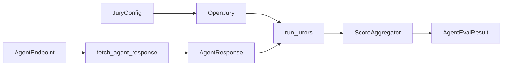

# Architecture

OpenJury evaluates **one agent response per prompt** using a panel of LLM jurors. Each juror scores the response against every configured criterion; scores are aggregated into rich metrics.

## Evaluation flow

### Steps

1. **Load config** — `JuryConfig.from_json_file()` validates criteria, jurors, and provider settings.
2. **Construct jury** — `OpenJury(config)` creates one `Juror` instance per juror config, resolving LLM credentials.
3. **Fetch agent response** — `fetch_agent_response()` POSTs to your agent endpoint with `{prompt}` substitution.
4. **Run jurors** — Each juror receives the prompt + response + rubrics, returns JSON scores per criterion.
5. **Aggregate** — `ScoreAggregator.compute_all()` produces `ScoredMetrics` (weighted mean, agreement, etc.).
6. **Return result** — `AgentEvalResult` with `composite_score`, per-criterion breakdown, optional consistency metrics.

## Public API methods

| Method | Use when |
|--------|----------|
| `evaluate()` / `score_response()` | Fetch from agent, then score |
| `score_existing_response()` | You already have the agent text |
| `run_jurors()` | Lower-level; returns `ScoringResult` with partial failures |
| `evaluate_items()` | Bounded parallel batch over many prompts |
| `score_batch()` | Sequential batch, fail-fast on first error |

See [composable-api.md](composable-api.md) for code examples.

## Concurrency

`ExecutionOptions` controls parallelism:

| Option | Default | Effect |
|--------|---------|--------|
| `max_juror_workers` | 5 | Parallel juror LLM calls per evaluation |
| `max_item_workers` | 1 | Parallel dataset items in `evaluate_items` |
| `max_outbound_requests` | 10 | Shared semaphore for all HTTP + LLM calls |

Prefer `ExecutionOptions(max_juror_workers=1)` over deprecated `OpenJury(parallel_execution=False)`.

## Error semantics

### Juror failures (partial)

Failed jurors are **skipped**; evaluation continues if at least one juror succeeds. Failures appear in `result.juror_failures`.

If **all** jurors fail → `OpenJuryEvaluationError`.

Each `JurorFailure.message` is the full error string, which for LLM provider errors can embed the raw upstream response body (OpenRouter, etc.) — useful for logs, but not safe to show end users since providers can add fields you didn't anticipate. When a provider error was recognized (`openai`/`anthropic` SDK exceptions today), `JurorFailure` also carries `http_status`, `provider_error_code`, `retry_after_seconds`, and `safe_summary` — a short string built only from those allowlisted fields. Prefer `safe_summary` over `message` for any user-facing surface; these fields are `None` when the failure didn't come from a recognized provider exception.

### Endpoint failures (fail-fast)

`EndpointFetchError` aborts the evaluation. Endpoint fetching has **no retry loop** (unlike juror calls which respect `max_retries`).

### Configuration failures

Missing `${ENV_VAR}` placeholders, invalid partial juror overrides, or unregistered custom scoring functions raise at init time (`ConfigurationError`, `OpenJuryInitializationError`).

## Consistency audit (`num_trials > 1`)

When `num_trials > 1`:

- OpenJury fetches the agent N times for the same prompt
- Each trial is scored independently
- **`composite_score` always comes from trial 1** (quality)
- `consistency_result.score_std` measures reliability across trials

Trials are not averaged into the quality score — users experience one response, not a mean.

## Scoring model

- **Criterion weight** — importance in composite score
- **Juror weight** — influence of each juror's scores
- **`composite_score`** — `scored_metrics.weighted_mean` on the 1–`score_scale` axis
- **`juror_agreement`** — 1.0 = unanimous; near 0 = contested

## Two credential domains

| Domain | Config location | Example env var |
|--------|-----------------|-----------------|
| Juror LLMs | `JuryConfig.llm_provider` or per-juror override | `OPENAI_API_KEY` |
| Agent endpoint | `AgentEndpoint.headers` | `AGENT_API_KEY` |

Credentials live in JSON config with `${VAR}` interpolation — not legacy env vars like `LLM_PROVIDER`.
